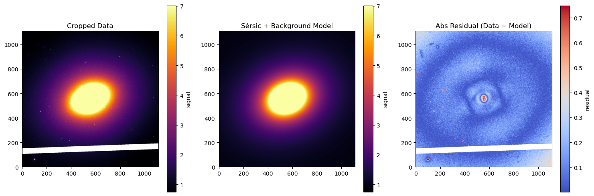
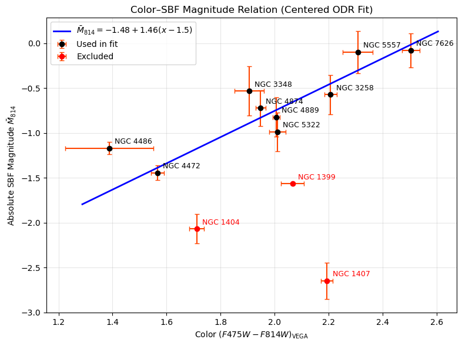

## Calibration of Surface Brightness Fluctuation color-magnetude curve for the HST ACS/WFC data and then using that to find unknown distances

### Intro: 
Hi, in this writeup, I am goanna explain about the project I did in the 3rd sem break. This is about the SBF method to measure the distances of elliptical galaxies. The motivation behind this project is, during my cosmology term paper, I came across the SBF method and found it very interesting. That's why I wanted to get some hands on experience on this method. Here I am goanna explain the algorithm that I have constructed to find the color and SBF magnetude of a galaxy. I am also attaching some codes and data files in the GitHub repository.

### Methodology and algorithm:
Here I am goanna explain the method using multiple points.
* **PSF construction:** I have constructed the PSF from the same FITS file which contains the galaxy image. I took two - three stars (point sources) from the image which are far away from the galaxy. Then I took fourier transform to get the Fourier space PSF. I used this PSF to fit the power spectrum later in the process.

* **Power Spectrum Fit:** I did this step using the code provided. The basic steps of the code are,
    1. Importing the data and print the details.
    2. Fit a 2d gaussian on the galaxy as it is computationally easier to do than other profiles. And also gaussian is the first choice of the astronomy people😅
    3. Used the gaussian fit width to crop the image to a resonable size (I did ~5 sigma for most of the galaxies)
    4. Used the gaussian fit parameters as initial guess for the Sersic profile fit on the galaxy data. This was much faster than doing the Sersic fit directly.
    5. Subtracted the continuum from the signal and normalized the residual by dividing with the square-root of the Sersic fit.
    6. Made custom mask to exclude the unwanted signals, background and foreground sources and the bright globular clusters. This code works on the following way,

        * i. It takes the residual and masks the region outside the range `0.5Re < r < 2.5Re` where the "Re" is the width parameter of the sersic fit.

        * ii. Then it runs a for loop where in each iteration it takes elliptical contors of width ~8 pixels and finds the mean and sigma of that. Then masks all the pixels having value greater than `mean + 3*sigma`. i have changed parameters to this and found this is the most stable configuration for the maximum sources.

        * iii. There is a option to apply manual mask on the image which points are not masked by the automated algorithm.

    7. Then took the fourier transform of the residual image.
    8. Averaged the 2d power spectrum azimuthally using the same elliptical contors.
    9. Did the fit described below on the power spectrum in the power range `0.08 ≤ k ≤ 0.25 pixel⁻¹`
            $P_{total} = P_{psf}*P_{SBF} + P_{noise}$ 
    10. The SBF aperant magnetude is, $m_{sbf} = -2.5log_{10}(P_{sbf})$

Data for M85 galaxy, 

* **Color measurement:** I applied the mask used in the background source subtraction for the residual signal on the galaxy signal and then did azimuthally avaraging of the intensity by using the same elliptical masks. In this way I got the radial intensity profile of the galaxy. I did this process for F814W band and F475W band [used F435W where F475W was not available and then converted the color to required band. The formula used is, $(F435W - F814W)_{\mathrm{VEGA}} = (F435W - F814W)_{\mathrm{STMAG}} + (\Delta_{435} - \Delta_{814})$].

     Then I measured the radial color profile using these plots and calculated average color and std.

* **Color- Magnetude calibration:** I used the data for some galaxies with known distances and calibrated the relation. The plot has been shown below.

* **Distance measurement:** I didn't get enough data. So I did the measurement for only 2 galaxies, The M85 and the NGC 3268. 

The distance value I got for M85 is `17.67 ± 0.87 Mpc` whereas the literature value is `18.5 ± 1.3 Mpc`. So my value is within 5% of the literature value.

The distance value I got for NGC 3268 is `46.78 ± 3.33 Mpc` whereas the literature value is `40 ± 4 Mpc`. So my value is within 20% of the literature value. But one thing to mention here is for this one, I didn't get the F475W band data. Instead I used the F435W band and converter the color using the approximate formula. This suggests that the approximate formula is also not very far off.

### Discussion and conclution: 
In this method, I have neglected few things, like I have not removed the undetected globular clusters and the undetected backgroud sources. Also during color measurement I didn't convolve the better resolution image with bad PSF, which made the color more red than it actually is. Also the color conversion from F435W to F475W is not accurate. I just approcimated it. But these are quite systematic and thus I got the trend. Also I did the measurement for only 2 galaxies which is not ideal. Thus I can't say that this is working well but I can safely conclude that my analysis shows the correlation betwen the color and SBF magnetude of the ellipticals. And I am quite happy with the results as I did this for the first time 😊
